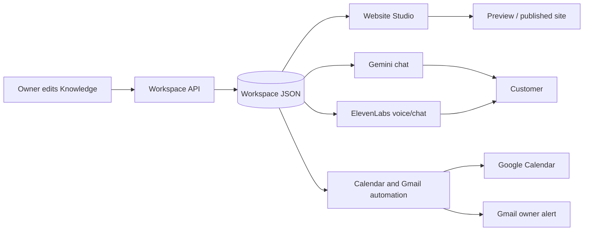
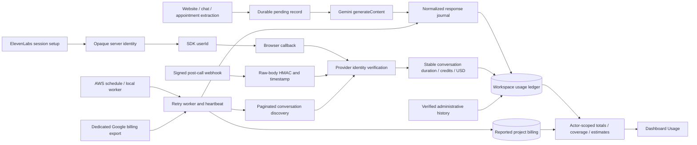
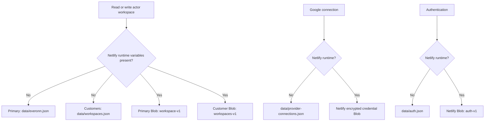
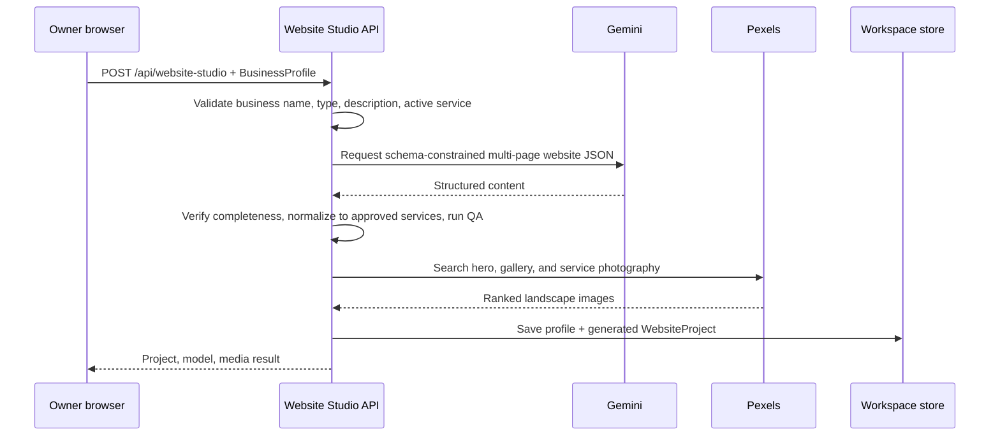
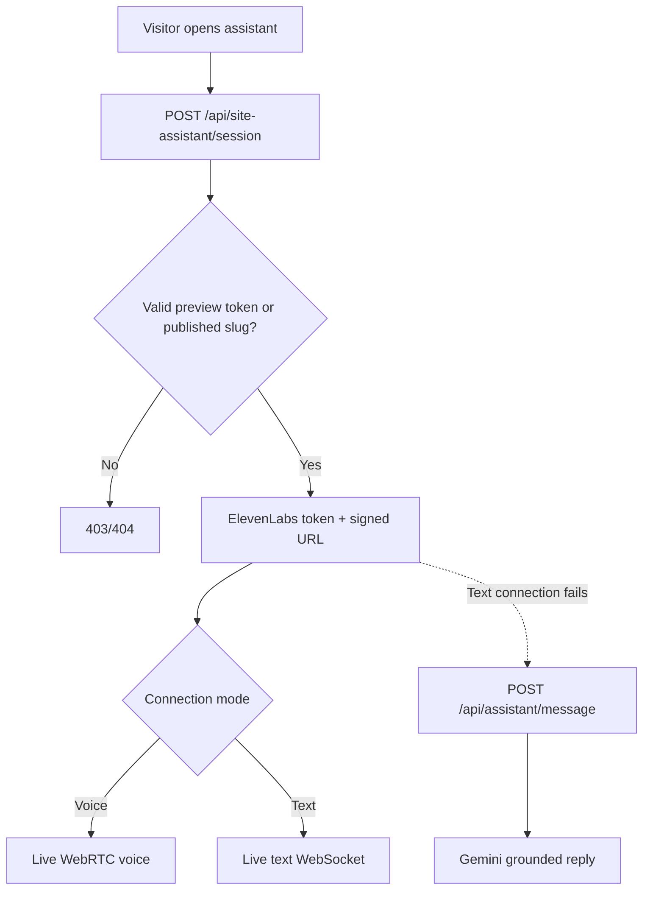
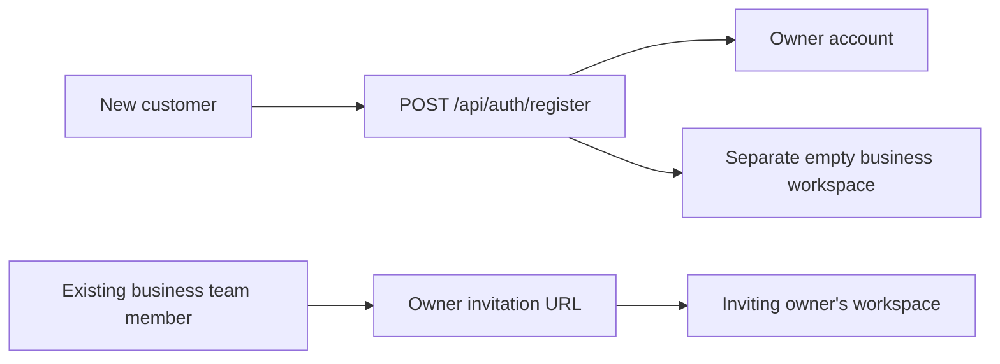
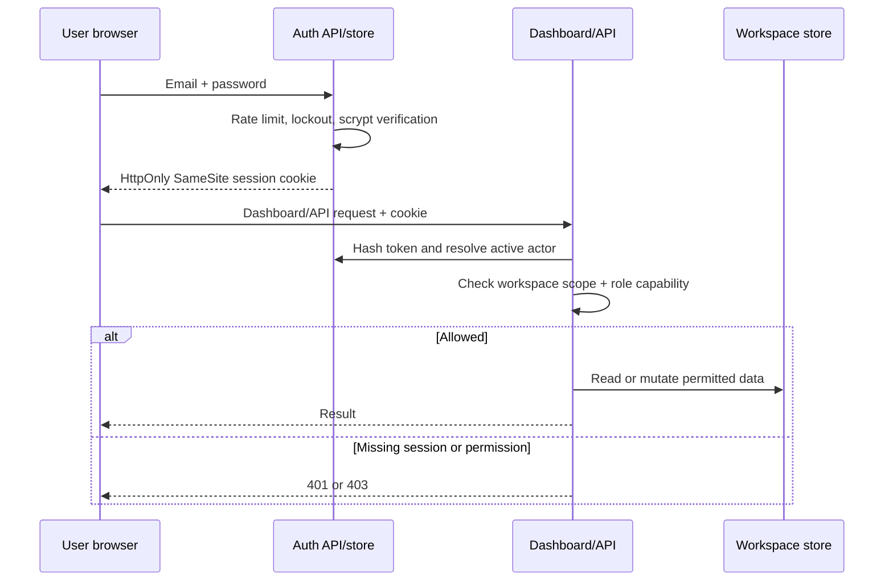

# EverOnn project data flow

This document explains how information moves through EverOnn. For a file-by-file and API reference, read [CODE_PROFILE.md](CODE_PROFILE.md). For meeting-ready answers, read [CLIENT_TECHNICAL_QA.md](CLIENT_TECHNICAL_QA.md).

## 1. The central rule

The saved business profile is the source of truth for the dashboard, generated website, AI chat, AI voice, appointment extraction, and follow-up.



Provider keys and Google tokens are separate from business data. They never enter the workspace JSON or browser responses.

## 2. Workspace load and save

### Provider usage metering (separate from business edits)



Gemini entry points supply a trusted workspace/feature to `meteredGeminiRequest`. Initial writes retry three times and must succeed before a chargeable request. Final normalized responses are journaled, then written to the ledger; write retries never repeat the provider call. The worker replays durable journals, while a process-memory fallback handles responses when both journal and ledger writes fail. Losing that process during a complete storage outage can still lose token metadata; the initial pending record exposes the gap. Captured metadata precedes application QA. Provider totals are preserved; cached input is not added twice.

The two ElevenLabs session APIs meter credentials and issue opaque workspace/feature/agent tickets. SDK callbacks supply only identities; metadata is retrieved from ElevenLabs. Discovery handles pagination and delayed/missed callbacks, including tickets older than 24 hours. Eligibility/next-check timestamps make recent sessions fast and unused/old sessions slower; provider failures back off. Global provider claims, stable event IDs and conditional PostgreSQL/Blob writes prevent cross-workspace assignment and duplicate charges. New conversation IDs reopen a previously complete ticket, and stale snapshots cannot remove newer conversations or reported billing fields. Text-chat duration is excluded from voice minutes.

`POST /api/usage/elevenlabs/webhook` validates the exact raw UTF-8 body with HMAC-SHA256 and a 30-minute past/one-minute future tolerance, caps streamed payloads at 2 MB, and verifies session/agent scope. Only normalized metrics are journaled; transcripts are discarded. It acknowledges only after durable acceptance and returns 503 on delivery failures so the provider can retry. A workspace receipt records actual verified webhook delivery. Replays update the same conversation ID. A delayed webhook cannot overwrite a newer direct provider read; a persisted recheck timestamp makes even a complete ticket eligible for authoritative verification. Provider-read start timestamps prevent a concurrently arriving webhook from being cleared by an older in-flight check.

`POST /api/usage/jobs` requires a server-only bearer secret of at least 32 characters. It runs a bounded all-workspace worker with journal recovery, eligible conversation checks and optional hourly BigQuery billing sync, then writes a heartbeat. Amplify uses the supplied EventBridge/Lambda template; long-lived local Node processes can enable `USAGE_BACKGROUND_MODE=in-process` or run `npm run usage:worker`. Instrumentation never starts timers in detected serverless runtimes. `POST /api/usage/sync` remains same-origin and actor-scoped. The page's polling/manual sync is additional recovery, not the unattended scheduler.

`GET /api/usage` requires `usage:view`, resolves workspace from the actor, and includes provider/feature totals, numeric daily buckets, coverage/missing-state flags, synchronization health, up to 50 recent rows, estimates and optional billed project totals. Dates for feature usage follow the business timezone; billing export uses its explicitly configured timezone and native currencies. Response projections exclude workspace/session identities and Google credentials.

Gemini standard text estimates are stored with their pricing basis/date; cached input and thinking output are priced once, and long-context/date tiers are applied only for supported models. Default list-price estimates do not assert the account's actual paid/free status. A configured workspace-dedicated Google project can import actual net charges after billing credits from BigQuery. Project/service/timezone query values are bound parameters, and table names are validated. Reported billing stays separate from feature estimates and may include project usage outside EverOnn. The export covers available rows in the last 365 days, refreshes hourly, and can lag provider activity; stale successful values are retained on errors.

Administrative history import validates a complete manifest before saving. Gemini exports use stable response IDs and optionally match an existing request ID to repair missing counts. Legacy ElevenLabs IDs are fetched from the provider and deliberately assigned by an administrator; identified conversations must already match their own workspace ticket. Re-running imports updates stable records. Imported-only dates remain explicitly partial and do not create zero-usage days between an old imported record and the start of live tracking. No history or missing metrics are fabricated.

Records live under event/session/outbox/claim/billing namespaces in the fixed Supabase `everonn_usage` schema, dedicated Netlify Blobs, or ignored local JSON. The PostgreSQL ledger keeps JSONB payloads, indexed key/workspace/type columns and UUID revisions. Atomic conditional writes reject stale instance updates; keyset listing preserves all pages. `SUPABASE_DB_URL` uses private pooled PostgreSQL with TLS, no prepared statements/pipelining and at most two connections per instance. When absent, server URL/secret variables use the explicit usage Data API profile. Partial configuration fails rather than saving to another backend. Only the dedicated migration runs; it does not modify AgenticThat's `public`/`agentic_that` data or migrate that repository. Private access requires no new exposed API schema. Optional Data API access requires an additive exposed-schema entry; browser roles receive no schema/table/function access. An unknown occupied usage schema aborts setup. Serverless deployments require durable storage before any paid provider call. The schema, Amplify environment/schedule, public webhook and optional BigQuery connection need production activation. See [USAGE_OPERATIONS.md](USAGE_OPERATIONS.md). Supabase usage persistence does not replace the existing file-backed authentication/business/Google-connection stores on Amplify. Local usage import retains source files and applies the existing merge/deduplication rules; worker health begins anew on the target backend.

The supplied Supabase project now contains the applied usage schema (verified 2026-10-03). Local real-database checks verified TLS certificate/hostname, server access and browser-role denial, stale-write protection, probe cleanup and a successful worker run. One original local usage event was transferred. The existing app's object/permission metadata fingerprint stayed unchanged. Deployment/environment changes on Amplify and external provider/scheduler connections still need activation.

During Amplify builds, `scripts/write-amplify-env.mjs` requires the live HTTPS origin and Supabase settings, then passes only whitelisted application variables into ignored `.env.production` for SSR. Literal dollars are escaped so Next.js expansion preserves secrets. The writer rejects another schema name, excludes build-role AWS credentials and forces durable storage/external scheduling. Missing deployment settings fail the build before publication; setting variables alone does not create the scheduled job or provider webhook.

### Browser startup

1. The dashboard server page reads the HttpOnly session and resolves the current actor.
2. Missing or expired sessions redirect to `/login` before the dashboard renders.
3. `AppChrome` mounts `WorkspaceProvider` only for authenticated dashboard routes.
4. `WorkspaceProvider` starts with `createDemoWorkspace()` only to render safely.
5. It calls authenticated `GET /api/workspace`.
6. The server reads only the JSON workspace named by the actor's server-side `workspaceId`, calculates live provider status, and returns the actor.
7. The browser replaces demo state with the saved workspace.

### Owner edit

1. A Knowledge or Settings control updates React state.
2. After 450 ms without another change, `WorkspaceProvider` sends the full workspace to `PUT /api/workspace`.
3. The server resolves the actor and checks capabilities for every changed section.
4. It verifies the workspace ID.
5. It preserves server-owned request details, provider delivery markers, and Google appointment rows, including records created concurrently by server automation. Incoming browser data cannot reset the automation lease.
6. It prevents an older browser copy from moving a published website backward.
7. The JSON store validates and saves the result atomically.

The browser also refreshes on focus, visibility changes, and every 15 seconds.

## 3. Persistence choice



- Local file writes use a temporary file and rename/copy replacement.
- A write queue prevents overlapping local operations.
- Blob writes use ETags and retry conflicts up to five times.
- Each account's server-resolved workspace ID selects exactly one business record; browser headers cannot grant access to another workspace.
- Moving to another host does not automatically move Netlify Blob data or OAuth tokens.
- A host with an ephemeral filesystem cannot safely persist this JSON between deployments without a durable volume or storage adapter.

## 4. Knowledge propagation

When an owner edits services or knowledge:

| Consumer | When it receives the change |
| --- | --- |
| Dashboard | Immediately in React state |
| Saved JSON | After the debounced workspace save |
| Gemini text assistant | On the next message, because the API reads the latest workspace |
| ElevenLabs session | On the next session, through fresh dynamic variables and receptionist instructions |
| Appointment extraction | On the next captured lead |
| Existing generated website | Not automatically |
| Newly regenerated website | Yes; content, service pages, and image searches are rebuilt |

Only `approved: true` knowledge items are inserted into the receptionist prompt.

## 5. Website generation and publication



Important controls:

- Gemini must return every approved active service; it cannot add unsupported services.
- Normalization keeps original service IDs and names.
- QA checks owner verification, service coverage, complete pages, FAQ depth, contact path, placeholders, and unsupported claims.
- Pexels failures do not replace content with fake images; the project can have missing media plus a warning.
- Regenerating creates a new project and a new private token.

### Preview flow

`/preview/[privateToken]` is a capability link. The server reads the project, validates the exact private token, and renders the preview as `noindex`. `/preview/demo` works only for a signed-in actor belonging to the workspace. Customer-assistant API calls always receive the project's real private token.

### Publish flow

1. Owner selects a concept.
2. Each button calls `POST /api/website-studio/status`.
3. Server allows only the next state: `generated → claimed → verified → approved → published`.
4. Publication requires passed QA and a selected concept.
5. `/sites/[publicSlug]` reads the published project on the server.
6. Unknown pages, wrong slugs, unpublished projects, or unselected concepts return 404.
7. The browser on a published site never downloads `/api/workspace`.

Generated routes are Home, Services, one route per service, About, and Contact.

## 6. Generated-site chat and voice



The server sends ElevenLabs business context as dynamic variables. It includes identity, active services, hours, service area, greeting, pricing/policies, timezone, and the complete approved receptionist prompt.

For site chat only, a failed ElevenLabs connection falls back to Gemini. Voice failure displays an error because Gemini text is not a voice replacement.

## 7. Lead capture

A lead is captured only after a transcript or ElevenLabs client tool supplies a phone number or email.

1. `WebsiteAssistant` or the dashboard AI agent builds transcript messages.
2. `extractCallerDetails()` finds a labeled/name phrase, phone, written or spoken email, and urgency keywords.
3. The browser calls `POST /api/site-assistant/lead`.
4. The route checks workspace, private token, or published slug access.
5. It normalizes phone/email and finds an existing contact.
6. It upserts the contact and lead by a browser-generated requestId, preserving automation state even when customer contact details change. Legacy callers without a requestId reuse an open lead for that contact. Request text is retained up to 12,000 characters; oversized requests fail with a clear error.
7. Progressive `finalize:false` calls save collecting details without provider actions. Final submission, Finish & save, voice disconnect, or closing the public assistant calls `processLeadAutomation(leadId, workspaceId)`. Browser capture calls run in sequence so a final request cannot overtake earlier details.
8. The response returns the saved lead, contact, possible appointment, and a non-fatal automation error.

The lead remains saved even if Google or Gemini automation fails.

## 8. Appointment and Gmail automation

```mermaid
sequenceDiagram
  participant L as Lead route
  participant A as Lead automation
  participant G as Gemini
  participant C as Google Calendar
  participant M as Gmail
  participant S as Workspace store

  L->>A: processLeadAutomation(leadId)
  A->>S: Read lead, contact, profile, connection state
  A->>S: Claim expiring workspace automation lease
  A->>G: Extract customer quotes + booking details (unless explicit form fields)
  alt No appointment requested
    A->>A: appointmentStatus = not_requested
  else Missing/ambiguous date or time
    A->>A: appointmentStatus = needs_details
  else Complete validated appointment request
    A->>C: Recover deterministic event if already accepted
    A->>C: Verified freeBusy on primary calendar when no existing event
    alt Busy
      A->>A: Save requested appointment; human follow-up required
    else Free
      A->>C: Insert event and optionally invite customer
      A->>A: Mark appointment confirmed
    end
  end
  A->>S: Save appointment + automation result
  A->>S: Persist pending + gmailAttemptedAt when eligible
  A->>M: Send owner lead summary once
  A->>S: Save sent identifier or delivery_unknown; release lease
  A-->>L: Updated lead and appointment
```

### Safety rules

- Gemini gets the current UTC time, business timezone, duration, approved services, and customer message.
- Service/date/time evidence must quote customer turns exactly. Independent date/time parsing checks the model timestamp against those quotes. Missing or ambiguous preferences are not booked. Explicit forms require an active service plus a valid future date and exact time, with no defaults.
- Gemini text asks a deterministic missing-service/date/time question before generation when a scheduling request lacks explicit preferences; the shared ElevenLabs prompt instructs the same collection. Voice session variables include both approved_instructions and faq_notes (the configured remote template uses faq_notes), plus live calendar_connected, duration, language, and handoff flags. Client tools return a structured booked flag from the server-confirmed event.
- Local business time is converted to UTC with IANA timezone handling. Invalid dates, nonexistent DST times, and repeated ambiguous DST times are rejected.
- Requests in the past or more than two years ahead are rejected.
- A busy slot is saved as `requested`, never `confirmed`.
- A cancelled appointment stays cancelled on retry; booking resumes only after the customer selects a different service, date, or time.
- Missing/error freeBusy data cannot establish a free slot. A free slot is confirmed only after Google creates or verifies the existing event.
- The original request, UTC start/end, customer details, and booking timezone are stored with the appointment. Busy/disconnected calendars retain an unconfirmed chosen slot, never an allocated alternative.

### Duplicate protection

- Calendar event ID is a deterministic hash of workspace ID + lead ID. A Google `409` loads the existing event instead of duplicating it.
- A confirmed appointment is retained; later detail changes are flagged for human review. A previously unconfirmed request can be retried with a new customer-selected time. A cancelled request cannot be recreated from the same saved selection. Recovering an existing event verifies its actual start/end; mismatches require review.
- Each workspace has an in-process queue and a five-minute durable automation lease. Netlify uses conditional writes across workers; local files support a single server process.
- Gmail pending/attempted/sent markers survive every progressive lead update and stale workspace autosave. Reservations are never reclaimed based on age.
- If a send times out or returns no message ID, delivery is marked delivery_unknown and automatic resend is blocked. Check the connected Gmail Sent folder before manually sending anything again.

### Where results appear

- `workspace.leads[].automation` stores Calendar/Gmail result and error text.
- `workspace.appointments[]` stores requested/confirmed appointment and Google IDs/URL.
- Dashboard Inbox shows Calendar/Gmail automation status.
- Dashboard Appointments shows the actual request and saved appointment, including customers still needing details. Its scheduling controls require a service, date, and time and are restricted to appointment operators. The public assistant exposes the same controls once callback details are saved.

## 9. Dashboard AI agent flow

### Gemini text test

1. Owner types in `/dashboard/ai-agent`.
2. Browser calls `POST /api/assistant/message` with the workspace header.
3. API reads the latest profile and builds the receptionist system prompt.
4. Gemini returns a grounded reply; browser speech synthesis can read it aloud.
5. When contact details appear in transcript state, the lead-capture flow runs.
6. “Finish & save summary” adds a conversation to browser workspace state, which autosaves through `PUT /api/workspace`.

### ElevenLabs voice test

1. Browser asks for microphone permission.
2. It calls `POST /api/voice/session`.
3. The server checks the workspace and uses the secret ElevenLabs API key to mint a short-lived token.
4. The browser starts a WebRTC session with business dynamic variables.
5. Transcript events update the dashboard.
6. Phone/email detection triggers the same lead endpoint and Google automation.

Transcript capture for the business inbox depends on the active browser session/client tools. The signed server webhook added for usage receives post-call data but discards transcripts and persists only normalized usage metrics; it does not populate the inbox.

## 10. Google OAuth flow

```mermaid
sequenceDiagram
  participant B as Browser
  participant E as EverOnn
  participant G as Google
  participant K as Encrypted credential store

  B->>E: GET /api/integrations/google/connect?workspaceId=...
  E->>E: Sign state; set HttpOnly nonce cookie
  E-->>B: Redirect to Google consent
  B->>G: Approve Calendar and Gmail scopes
  G-->>E: GET callback?code=...&state=...
  E->>E: Verify signature, expiry, cookie, workspace
  E->>G: Exchange code for access + refresh token
  E->>K: AES-256-GCM encrypted connection
  E-->>B: Redirect /dashboard/settings?google=connected
```

Required scopes are Calendar events, Calendar free/busy, and Gmail send. Access tokens refresh automatically shortly before expiration.

The callback URI is derived from the current origin, except on Netlify where `SITE_NAME` produces the stable `https://{site}.netlify.app/api/integrations/google/callback` URI. The exact URI displayed in Settings must exist in Google Cloud Console.

## 11. Access-control flow

### Account entry paths



“Create a new account” always creates a separate owner workspace with empty leads, contacts, conversations, appointments, and website state. It never adds a user to an existing customer's data. Managers, agents, and viewers join an existing workspace only through its owner's one-use invitation.



| Surface | Current check |
| --- | --- |
| Dashboard page and workspace APIs | Server-resolved active session, workspace scope, and required role capability |
| Owner setup | Production-only setup secret plus empty authentication store |
| Public registration | Rate limited; globally unique email; creates a unique owner workspace rather than joining an existing one |
| Team invitations | Owner-only creation; 256-bit, hashed, one-use token; seven-day expiry; owner role cannot be invited |
| Private website | Exact private capability token |
| Published website assistant | Matching slug and project status `published` |
| Google callback | Signed/expiring state + matching HttpOnly nonce cookie + workspace ID |
| Provider tokens | Server-only environment/encrypted storage |

Roles are enforced on the server: owner has all capabilities; manager can configure business/AI/website and operate customers; agent can operate inbox/calls/appointments; viewer is read-only. The `x-everonn-workspace` header selects scope but never proves identity by itself.

State-changing API routes also call `assertSameOrigin()`. For browser requests, `features/auth/request-origin.ts` compares the exact HTTP(S) `Origin` with the configured `NEXT_PUBLIC_APP_URL`; when unset, it compares with the request URL's origin. Configuring the public origin supports Amplify or other proxies whose internal request URL differs from the browser URL. Invalid configured URLs and unrelated browser origins fail the check; `Host` and `X-Forwarded-*` headers do not grant trust. Non-browser requests without `Origin` retain existing behavior.

Amplify must receive the public URL and owner setup token through its Next.js build/runtime environment. Passing those values does not add durable AWS persistence: outside Netlify, authentication and workspace stores still use local JSON files.

## 12. Known non-data flows

These screens do not currently reach a backend:

- marketing demo/preview request form;
- marketing “Ask EverOnn” widget, which uses local scripted product answers;
- subscription billing provider calls (the UI reports that billing is unavailable);
- invitation email delivery (account creation through the URL is implemented);
- self-service forgotten-password recovery and MFA;

Do not confuse the marketing scripted widget with the generated customer-site assistant: the customer-site assistant uses ElevenLabs and Gemini.

## 13. Fast debugging map

| Problem | Start here | Then inspect |
| --- | --- | --- |
| Workspace changes do not persist | `features/everonn/workspace-provider.tsx` | `/api/workspace`, `lib/json-workspace-store.ts` |
| Login or role access fails | `/api/auth/login` or `features/auth/session.ts` | `lib/auth-store.ts`, `features/auth/rbac.ts`, `data/auth.json`/auth Blob |
| Gemini chat gives an error | `/api/assistant/message` | `features/voice-agent/gemini.ts`, provider env |
| Voice will not connect | `/api/voice/session` or `/api/site-assistant/session` | ElevenLabs key, agent ID, browser microphone permission |
| Website generation fails | `/api/website-studio` | `ai-generator.ts`, Gemini model list, QA error |
| Generated images are missing | `features/website-studio/media.ts` | `PEXELS_API_KEY`, Pexels response, remote image host config |
| Google connect fails | `/api/integrations/google/connect` and callback | redirect URI, client credentials, encryption key, OAuth scopes |
| Lead saves but no appointment | `features/integrations/lead-automation.ts` | lead reason, appointment extraction, timezone, Google scopes/freeBusy |
| Gmail is not sent | lead `automation.gmailStatus/message` | profile email, follow-up switch, Gmail scope, OAuth token |
| Published site is 404 | `app/sites/[slug]/site.tsx` | status, public slug, selected concept, requested route |

Whenever one of these paths changes, update this document in the same code change.

The primary US Carpentry workspace uses carpentry services documented in its saved description and Asia/Kolkata for its Hyderabad location. Identified Northstar profile details, sample customer records, sample appointment, and sample team members were removed; unsupported after-hours sample knowledge was unapproved. Existing real Google appointments retain their original booking timezone and show a review notice when it differs from the current business timezone. The private generated website was rebuilt from the corrected profile through Gemini/Pexels and remains unpublished.

Both voice session routes use `features/voice-agent/session-context.ts`. The existing ElevenLabs template reads faq_notes rather than approved_instructions, so the full approved receptionist rules are supplied through both variables. Calendar/handoff/duration/language fields now match the remote template. Website and dashboard voice tools use the real lead endpoint result; booked=true requires a confirmed Calendar appointment. The configured provider key allows reading the remote agent but its prompt update request returned HTTP 401, so remote configuration was left unchanged and the supported existing dynamic-variable contract is used.

Dashboard Inbox filters now select real subsets, and authorized operators can update lead status. Contacts can be added with callback validation and their details/call/email links can be opened. The notification icon opens Inbox. Billing shows its unconnected state without fictitious subscription prices, usage, or invoice dates. Customer Settings no longer exposes the demo-reset action. Latest customer phone/email/name corrections are extracted, and newer contact records survive stale browser autosaves.
