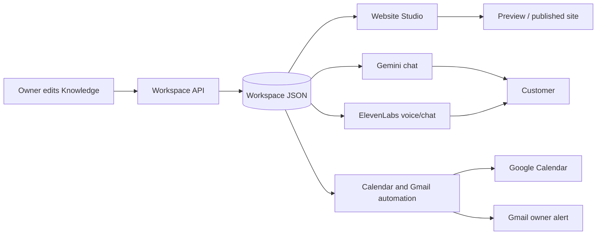
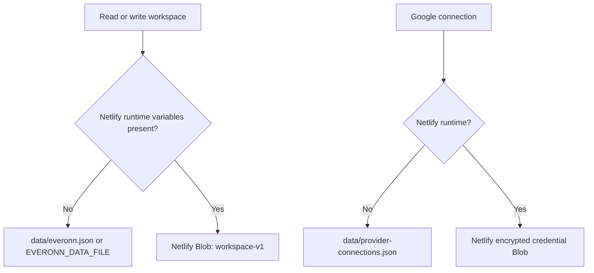
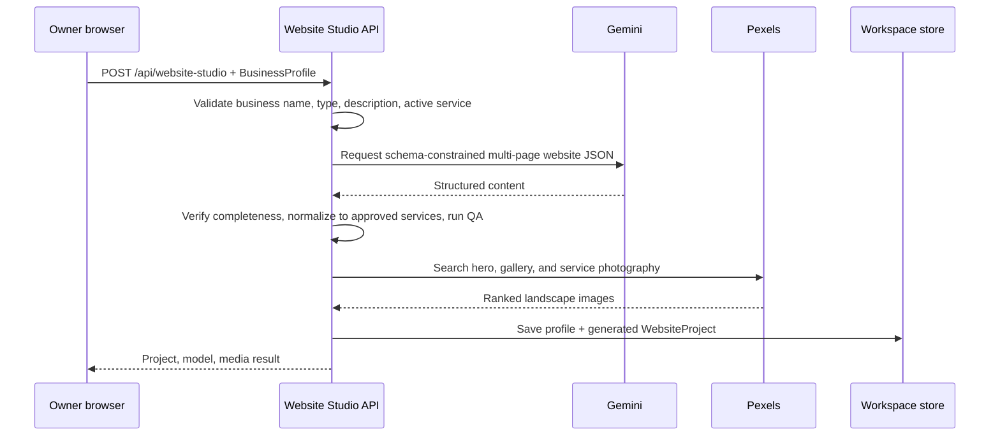
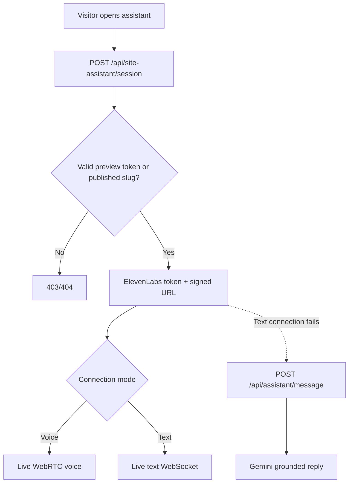

# EverOnn project data flow

This document explains how information moves through EverOnn. For a file-by-file and API reference, read [CODE_PROFILE.md](CODE_PROFILE.md). For meeting-ready answers, read [CLIENT_TECHNICAL_QA.md](CLIENT_TECHNICAL_QA.md).

## 1. The central rule

The saved business profile is the source of truth for the dashboard, generated website, AI chat, AI voice, appointment extraction, and follow-up.



Provider keys and Google tokens are separate from business data. They never enter the workspace JSON or browser responses.

## 2. Workspace load and save

### Browser startup

1. `AppChrome` mounts `WorkspaceProvider` for marketing, dashboard, login, and preview routes.
2. `WorkspaceProvider` starts with `createDemoWorkspace()` only to render safely.
3. It calls `GET /api/workspace`.
4. The server reads the real JSON workspace and calculates live provider status.
5. The browser replaces demo state with the saved workspace.

### Owner edit

1. A Knowledge or Settings control updates React state.
2. After 450 ms without another change, `WorkspaceProvider` sends the full workspace to `PUT /api/workspace`.
3. The server verifies the workspace ID.
4. It preserves contacts/leads/appointments created concurrently by server automation.
5. It prevents an older browser copy from moving a published website backward.
6. The JSON store validates and saves the result atomically.

The browser also refreshes on focus, visibility changes, and every 15 seconds.

## 3. Persistence choice



- Local file writes use a temporary file and rename/copy replacement.
- A write queue prevents overlapping local operations.
- Blob writes use ETags and retry conflicts up to five times.
- Moving to another host does not automatically move Netlify Blob data or OAuth tokens.
- A host with an ephemeral filesystem cannot safely persist this JSON between deployments without a durable volume or storage adapter.

## 4. Knowledge propagation

When an owner edits services or knowledge:

| Consumer | When it receives the change |
| --- | --- |
| Dashboard | Immediately in React state |
| Saved JSON | After the debounced workspace save |
| Gemini text assistant | On the next message, because the API reads the latest workspace |
| ElevenLabs session | On the next session, through fresh dynamic variables and receptionist instructions |
| Appointment extraction | On the next captured lead |
| Existing generated website | Not automatically |
| Newly regenerated website | Yes; content, service pages, and image searches are rebuilt |

Only `approved: true` knowledge items are inserted into the receptionist prompt.

## 5. Website generation and publication



Important controls:

- Gemini must return every approved active service; it cannot add unsupported services.
- Normalization keeps original service IDs and names.
- QA checks owner verification, service coverage, complete pages, FAQ depth, contact path, placeholders, and unsupported claims.
- Pexels failures do not replace content with fake images; the project can have missing media plus a warning.
- Regenerating creates a new project and a new private token.

### Preview flow

`/preview/[privateToken]` is a capability link. The preview is `noindex` and renders the chosen concept from browser workspace state. The UI also accepts `/preview/demo` as a local/demo viewing alias, but customer-assistant API calls require the project's real private token.

### Publish flow

1. Owner selects a concept.
2. Each button calls `POST /api/website-studio/status`.
3. Server allows only the next state: `generated → claimed → verified → approved → published`.
4. Publication requires passed QA and a selected concept.
5. `/sites/[publicSlug]` reads the published project on the server.
6. Unknown pages, wrong slugs, unpublished projects, or unselected concepts return 404.
7. The browser on a published site never downloads `/api/workspace`.

Generated routes are Home, Services, one route per service, About, and Contact.

## 6. Generated-site chat and voice



The server sends ElevenLabs business context as dynamic variables. It includes identity, active services, hours, service area, greeting, pricing/policies, timezone, and the complete approved receptionist prompt.

For site chat only, a failed ElevenLabs connection falls back to Gemini. Voice failure displays an error because Gemini text is not a voice replacement.

## 7. Lead capture

A lead is captured only after a transcript or ElevenLabs client tool supplies a phone number or email.

1. `WebsiteAssistant` or the dashboard AI agent builds transcript messages.
2. `extractCallerDetails()` finds a labeled/name phrase, phone, written or spoken email, and urgency keywords.
3. The browser calls `POST /api/site-assistant/lead`.
4. The route checks workspace, private token, or published slug access.
5. It normalizes phone/email and finds an existing contact.
6. It upserts the contact and an open lead instead of creating obvious duplicates.
7. It immediately calls `processLeadAutomation(leadId)`.
8. The response returns the saved lead, contact, possible appointment, and a non-fatal automation error.

The lead remains saved even if Google or Gemini automation fails.

## 8. Appointment and Gmail automation

```mermaid
sequenceDiagram
  participant L as Lead route
  participant A as Lead automation
  participant G as Gemini
  participant C as Google Calendar
  participant M as Gmail
  participant S as Workspace store

  L->>A: processLeadAutomation(leadId)
  A->>S: Read lead, contact, profile, connection state
  A->>S: Reserve Gmail status as pending when eligible
  A->>G: Extract booking intent, service, local date/time
  alt No appointment requested
    A->>A: appointmentStatus = not_requested
  else Missing/ambiguous date or time
    A->>A: appointmentStatus = needs_details
  else Complete appointment request
    A->>C: freeBusy on primary calendar
    alt Busy
      A->>A: Save requested appointment; human follow-up required
    else Free
      A->>C: Insert event and optionally invite customer
      A->>A: Mark appointment confirmed
    end
  end
  A->>M: Send owner lead summary
  A->>S: Save appointment + automation result
  A-->>L: Updated lead and appointment
```

### Safety rules

- Gemini gets the current UTC time, business timezone, duration, approved services, and customer message.
- It must return an empty time when date or time is missing or ambiguous.
- Local business time is converted to UTC with IANA timezone handling.
- Requests in the past or more than two years ahead are rejected.
- A busy slot is saved as `requested`, never `confirmed`.
- A free slot is confirmed only after Google creates the event.

### Duplicate protection

- Calendar event ID is a deterministic hash of workspace ID + lead ID. A Google `409` loads the existing event instead of duplicating it.
- An existing appointment for the lead is reused.
- Gmail status is reserved as `pending`; a fresh reservation blocks a second sender.
- A `sent` Gmail message is not sent again. A stuck pending reservation can retry after two minutes.

### Where results appear

- `workspace.leads[].automation` stores Calendar/Gmail result and error text.
- `workspace.appointments[]` stores requested/confirmed appointment and Google IDs/URL.
- Dashboard Inbox shows Calendar/Gmail automation status.
- Dashboard Appointments shows the saved appointment.

## 9. Dashboard AI agent flow

### Gemini text test

1. Owner types in `/dashboard/ai-agent`.
2. Browser calls `POST /api/assistant/message` with the workspace header.
3. API reads the latest profile and builds the receptionist system prompt.
4. Gemini returns a grounded reply; browser speech synthesis can read it aloud.
5. When contact details appear in transcript state, the lead-capture flow runs.
6. “Finish & save summary” adds a conversation to browser workspace state, which autosaves through `PUT /api/workspace`.

### ElevenLabs voice test

1. Browser asks for microphone permission.
2. It calls `POST /api/voice/session`.
3. The server checks the workspace and uses the secret ElevenLabs API key to mint a short-lived token.
4. The browser starts a WebRTC session with business dynamic variables.
5. Transcript events update the dashboard.
6. Phone/email detection triggers the same lead endpoint and Google automation.

There is no server webhook ingest in this version; transcript capture depends on the active browser session/client tools.

## 10. Google OAuth flow

```mermaid
sequenceDiagram
  participant B as Browser
  participant E as EverOnn
  participant G as Google
  participant K as Encrypted credential store

  B->>E: GET /api/integrations/google/connect?workspaceId=...
  E->>E: Sign state; set HttpOnly nonce cookie
  E-->>B: Redirect to Google consent
  B->>G: Approve Calendar and Gmail scopes
  G-->>E: GET callback?code=...&state=...
  E->>E: Verify signature, expiry, cookie, workspace
  E->>G: Exchange code for access + refresh token
  E->>K: AES-256-GCM encrypted connection
  E-->>B: Redirect /dashboard/settings?google=connected
```

Required scopes are Calendar events, Calendar free/busy, and Gmail send. Access tokens refresh automatically shortly before expiration.

The callback URI is derived from the current origin, except on Netlify where `SITE_NAME` produces the stable `https://{site}.netlify.app/api/integrations/google/callback` URI. The exact URI displayed in Settings must exist in Google Cloud Console.

## 11. Access-control flow

| Surface | Current check |
| --- | --- |
| Dashboard workspace APIs | Matching `x-everonn-workspace` where the route requires it |
| Private website | Exact private capability token |
| Published website assistant | Matching slug and project status `published` |
| Google callback | Signed/expiring state + matching HttpOnly nonce cookie + workspace ID |
| Provider tokens | Server-only environment/encrypted storage |

Important: the current login is a demonstration, so the workspace header is not proof of identity. Production access needs a real authentication session, server-side actor identity, and RBAC enforcement at every private API boundary.

## 12. Known non-data flows

These screens do not currently reach a backend:

- marketing demo/preview request form;
- marketing “Ask EverOnn” widget, which uses local scripted product answers;
- login/reset/MFA;
- billing controls;
- actual invitation delivery/account creation;
- “Add contact” button.

Do not confuse the marketing scripted widget with the generated customer-site assistant: the customer-site assistant uses ElevenLabs and Gemini.

## 13. Fast debugging map

| Problem | Start here | Then inspect |
| --- | --- | --- |
| Workspace changes do not persist | `features/everonn/workspace-provider.tsx` | `/api/workspace`, `lib/json-workspace-store.ts` |
| Gemini chat gives an error | `/api/assistant/message` | `features/voice-agent/gemini.ts`, provider env |
| Voice will not connect | `/api/voice/session` or `/api/site-assistant/session` | ElevenLabs key, agent ID, browser microphone permission |
| Website generation fails | `/api/website-studio` | `ai-generator.ts`, Gemini model list, QA error |
| Generated images are missing | `features/website-studio/media.ts` | `PEXELS_API_KEY`, Pexels response, remote image host config |
| Google connect fails | `/api/integrations/google/connect` and callback | redirect URI, client credentials, encryption key, OAuth scopes |
| Lead saves but no appointment | `features/integrations/lead-automation.ts` | lead reason, appointment extraction, timezone, Google scopes/freeBusy |
| Gmail is not sent | lead `automation.gmailStatus/message` | profile email, follow-up switch, Gmail scope, OAuth token |
| Published site is 404 | `app/sites/[slug]/site.tsx` | status, public slug, selected concept, requested route |

Whenever one of these paths changes, update this document in the same code change.
