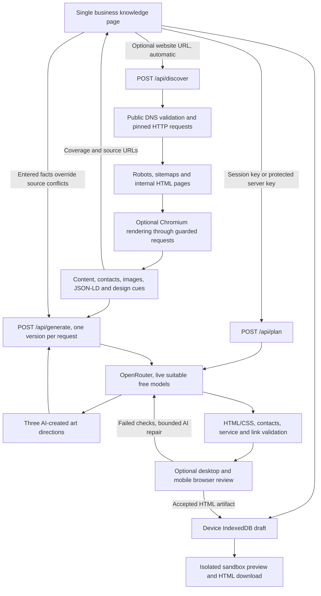

# Website Studio data flow

The browser starts URL discovery after a 1.7-second pause. A changed URL cancels the prior request. Generation waits for matching discovery; unreadable sites require explicit description-only continuation. Source contacts are displayed as evidence rather than silently overwriting entered fields.

The model catalogue uses fixed `https://openrouter.ai/api/v1/models`. The generation provider uses fixed `https://openrouter.ai/api/v1/chat/completions`. Credentials are server-only environment values or ephemeral request headers supplied by the user. They never enter IndexedDB or exported knowledge. Discovery directly requests the user-supplied public source after URL, DNS, redirect and resource checks. Chromium receives fulfilled guarded network responses and no provider credentials.

The plan is entirely AI-created and locally schema-validated. Each independent generation request gets the entered knowledge, evidence from every captured page, a distinct AI direction and brief context about accepted earlier versions. The original HTML/CSS is preserved apart from the injected security policy. Rejected output is never shown as a completed site. Completed versions save independently; cancellation or a failed later version keeps earlier artifacts. Retry uses the same plan and unchanged knowledge. Editing knowledge or refreshing source discovery invalidates the prior generation fingerprint and leads to a fresh plan on the next generation. Creating a new set after all three complete also makes a fresh plan.

Evidence scope: same-origin public HTML pages reachable through links/sitemaps; 40 successful pages, 120 attempts and 180 seconds maximum. Query/filter pages, restricted content and unrelated origins are excluded. Body text and AI context are bounded; contacts and metadata are retained separately. Coverage, truncation, skipped URLs and missing rendering are surfaced. The new site is a single static document combining useful source knowledge, not a clone of all source routes.

Preview iframes have an empty sandbox permission list and a restrictive CSP, disabling scripts, forms, frames and network data requests. Images/Google Fonts can load as permitted presentation assets. Downloads include the same policy. No generated code executes in the studio's origin.
