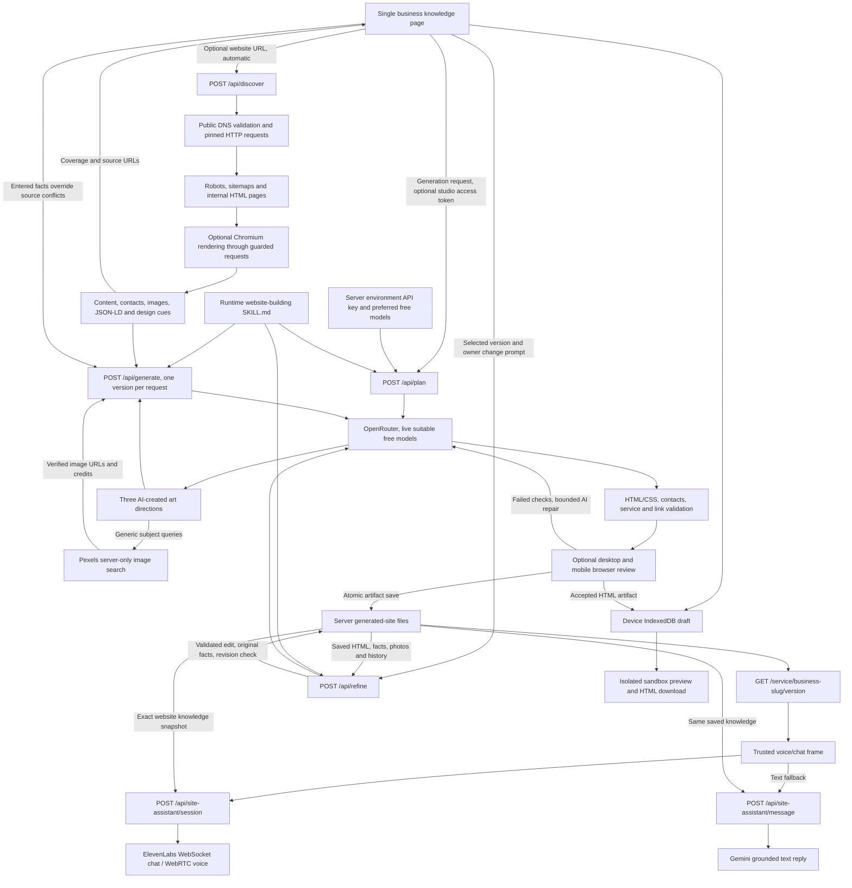

# Website Studio data flow

The browser starts URL discovery after a 1.7-second pause. A changed URL cancels the prior request. Generation waits for matching discovery; unreadable sites require explicit continuation using the entered business knowledge. Source contacts are displayed as evidence rather than silently overwriting entered fields.

The model catalogue uses fixed `https://openrouter.ai/api/v1/models`. The generation provider uses fixed `https://openrouter.ai/api/v1/chat/completions`. The provider key comes only from the server environment, never from browser inputs/headers. Browser-supplied provider keys are ignored. A separate studio access token authorizes production generation; only this access token can be sent by the browser. Neither credential enters IndexedDB or exported knowledge. Pexels credentials likewise stay on the server. `OPENROUTER_MODELS` overrides the preferred free-model order; blank defaults to Inkling, Laguna S 2.1 and Nemotron 3 Ultra. Every candidate must still qualify in the live catalogue; unavailable or paid preferences are skipped and fallback stays free. Discovery directly requests the user-supplied public source after URL, DNS, redirect and resource checks. Chromium receives fulfilled guarded network responses and no provider credentials.

The plan is AI-created and locally schema-validated, including one or two generic photo search phrases per direction. The server reads ai/capabilities/website-building/SKILL.md for planning, generation and refinement. It supplies design/factual/accessibility rules without fixed layouts or CSS; a missing skill fails explicitly. Each independent generation request gets the entered knowledge, evidence from every captured page, a distinct AI direction, verified photo assets and brief context about accepted earlier versions. The original HTML/CSS is preserved apart from the injected security policy. Rejected output is never shown as a completed site. Completed versions save independently; cancellation or a failed later version keeps earlier artifacts. Retry uses the same plan and unchanged knowledge. Editing knowledge or refreshing source discovery invalidates the prior generation fingerprint and leads to a fresh plan on the next generation. Creating a new set after all three complete also makes a fresh plan.

Evidence scope: same-origin public HTML pages reachable through links/sitemaps; 40 successful pages, 120 attempts and 180 seconds maximum. Query/filter pages, restricted content and unrelated origins are excluded. Body text and AI context are bounded; contacts and metadata are retained separately. Coverage, truncation, skipped URLs and missing rendering are surfaced. The new site is a single static document combining useful source knowledge, not a clone of all source routes.

Studio design-preview iframes have an empty sandbox permission list and a restrictive CSP, disabling scripts, forms, frames and network data requests. Images/Google Fonts can load as permitted presentation assets. Downloads include the same policy. A separate trusted assistant frame is overlaid beside the preview; it can run the application-authored controls, request microphone permission and call assistant APIs. AI-generated code never executes in the studio's origin.

After validation, `POST /api/generate` saves the artifact before returning it with a `path`: `/service/{business-slug}/{index+1}`. The required business name supplies the slug; legacy unnamed slugs remain readable. File storage defaults to ignored `data/generated-sites` or the configured `GENERATED_SITES_DIR`. A temporary-file/rename write replaces only the successful corresponding business/version file. Failed generation or saving keeps the prior file. Same slug/version always serves its latest successful artifact.

The studio shows the path and an Open website link. `GET /service/[business]/[version]` serves stored HTML/CSS directly with a small trusted assistant bootstrap, without the studio's layout or an AI call. It accepts versions 1–3 and returns 404 for missing/invalid addresses. Links work after refresh and from another browser that can reach the running app. These generated outputs are publicly readable on this server; generation access remains guarded. Response CSP permits only the exact hash of the application-owned bootstrap and a same-origin trusted assistant frame; model-authored scripts remain blocked. Hosting must provide a persistent writable directory, shared across instances. This does not deploy the app to an external host.

Generation saves the exact `knowledgePacket(knowledge, discovery)` as `knowledgeJson` alongside each artifact. Both assistant channels load that snapshot through business/version/artifact revision. Visitor messages and source text cannot select a different knowledge packet. Editing the studio form alone does not change a saved website or its assistant; regeneration updates the corresponding version and knowledge together. Old revisions fail safely rather than mixing a new business context with an old page.

The trusted widget calls the same ElevenLabs endpoints as the main project, issuing only the credential for its selected mode. Browser initialization sends existing dynamic-variable names and factual instructions, without changing the shared agent template. Voice uses WebRTC and explicit microphone permission; text uses a text-only WebSocket session. Failed live chat can use the Gemini message endpoint with the same server-selected snapshot. Conversation tokens are transient; provider keys remain in the server environment. Closing/switching/unmounting cancels pending operations and ends active sessions. Optional callback/booking tool names return unavailable state because this branch does not connect those main-project workflows.

## Photography and owner edits

Pexels searches use `https://api.pexels.com/v1/search` with the server-only Authorization key and one or two generic, AI-selected subject phrases per direction. No original knowledge packet is sent to Pexels. Verified images are returned in plan media bundles, including exact image URLs, alt text, dimensions, photographers and credit links. Metadata caching lasts 24 hours in bounded in-process maps; simultaneous identical queries share a request. A generation request submits IDs, which the server checks against cached/provider metadata through `/v1/photos/{id}`. Provider failures/no results are explicit; fabricated image URLs are rejected. Used Pexels assets require visible Pexels and photographer links in the generated document and downloaded HTML. Stock photographs are illustrative rather than business facts.

The selected-version prompt sends only business slug, version, current revision, change request and optional model choice to `POST /api/refine`. The server loads original knowledge/discovery, approved photographs, original direction, accepted edit history and current HTML from that saved version, plus brief sibling context. Skill instructions are read from disk and supplied as system input; owner edit intent is provided separately from untrusted website evidence. AI returns the complete revised HTML, which follows the same factual/image/HTML/CSS and viewport checks as initial generation. Original knowledge is retained, so the assistant continues using the same facts under the new artifact revision.

Successful edits atomically replace only the selected version at the same URL. The old revision must match both before inference and at save time; conflicts return 409 with the latest artifact and retain the latest accepted file. The studio loads that artifact while keeping the unsent prompt for review/retry. Same-process writes are serialized, but there is no distributed edit lock across Node processes. Failed inference/validation/storage leaves the accepted site intact. The browser preserves a failed request for retry, saves accepted edit history and unsent prompts to IndexedDB, and refreshes the trusted assistant frame using the returned revision. Last 20 edit requests are saved; last eight accompany the next inference. Regeneration starts fresh design history. Older versions without an editable snapshot/direction require regeneration from completed business knowledge once.
