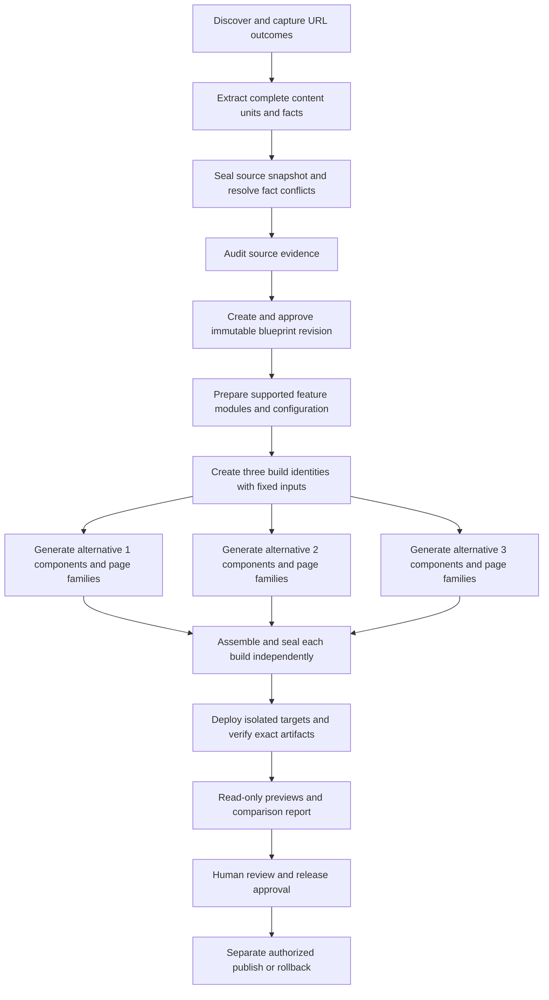

# 2. Job orchestration

Status: proposed worker/API contracts. Current discovery is request-streamed and generation runs inside request handlers; no durable queue or worker service exists yet. Entity names follow [database and storage](01-database-and-storage.md).

## Dependency graph



Extraction may run per capture while discovery continues; snapshot sealing waits for final membership/outcomes. Audits can expose missing facts that require owner resolution. Approval and missing feature configuration are explicit persisted waits. No worker supplies owner approval on the customer's behalf.

Each alternative progresses independently. A failed alternative leaves completed sibling builds readable. The overall three-alternative delivery gate waits for all three to meet the agreed scope. An individual release approval/publication remains separate.

## Stage outputs and dependency rules

| Stage                     | Input contract                                                                 | Persisted success output                                                                                        |
| ------------------------- | ------------------------------------------------------------------------------ | --------------------------------------------------------------------------------------------------------------- |
| `discover`                | Authorized project URL, normalized scope, crawl limits, robots/resource policy | Durable frontier and final URL outcomes; capture objects/metadata; coverage and limitations                     |
| `extract`                 | Captured bytes/DOM with hashes, pinned extractor version                       | Source-supported content units, contacts, media and feature observations; explicit completeness                 |
| `snapshot`                | Final URL outcomes and successful extraction records                           | Immutable manifest and snapshot membership/hash                                                                 |
| `facts`                   | Snapshot, candidate facts and authenticated owner decisions                    | Approved immutable fact-set version; unresolved critical conflicts block                                        |
| `audit`                   | Snapshot/fact set, versioned audit tool/configuration                          | Findings classified by evidence kind; comparable baseline measurements where available                          |
| `blueprint`               | Snapshot, facts, audit, supported feature catalogue                            | Approved revision containing full route/source mappings, content requirements, features and acceptance criteria |
| `feature_prepare`         | Blueprint feature version and configuration revision                           | Verified module contract, dependencies, preview bindings and production configuration requirements              |
| `design`                  | Fixed build inputs, alternative brief, approved assets                         | Alternative design system and reusable component contracts                                                      |
| `page_family` / `content` | Route group, content-unit requirements, design system and exact evidence       | Accepted family components and structured page records; coverage/compile checks                                 |
| `assemble`                | Accepted components/content/assets/features                                    | Valid source project, dependency lock, compile output and complete route manifest                               |
| `seal`                    | Artifact hashes and finalized blueprint membership                             | Immutable build seal; subsequent changes fork a child build                                                     |
| `deploy_preview`          | Sealed artifact digest and environment bindings                                | Read-only isolated deployment identity, health and digest confirmation                                          |
| `verify`                  | Sealed build, deployment, criterion/check versions and fixture environment     | Exact-build test results, evidence, failures/inconclusive checks and gate evaluation                            |
| `compare`                 | Source baseline and qualifying per-build evidence                              | Comparison report with measured/judged/predicted distinctions and limitations                                   |

Enquiry/booking modules are prepared before UI generation. A required missing connection sets `configuration_required`: an informational development preview may still be generated, but the required feature and final website cannot pass. Queue dependency satisfaction requires persisted successful output, not a completion message from an AI model.

## Persisted task contract

Workers receive IDs and hashes, not a browser's full mutable knowledge packet:

```json
{
  "schemaVersion": 1,
  "tenantId": "tenant-uuid",
  "projectId": "project-uuid",
  "pipelineRunId": "run-uuid",
  "jobId": "job-uuid",
  "buildId": "build-uuid",
  "stage": "page_family",
  "targetKey": "services",
  "sourceSnapshotId": "snapshot-uuid",
  "factSetId": "facts-uuid",
  "blueprintRevisionId": "blueprint-uuid",
  "generationConfigurationId": "config-uuid",
  "inputSha256": "sha256-of-canonical-task-inputs",
  "leaseToken": 7
}
```

The UUID labels illustrate identities and must be real validated UUIDs at runtime. Server-side loading verifies ownership, input membership, approval and hashes before work. `targetKey` identifies a route, page family, feature or whole build; it is never a filesystem path supplied without validation.

The idempotency key is a SHA-256 of schema version, tenant/project, run or build ID, stage, target and canonical input hash. A new blueprint/fact/configuration revision changes the input identity and creates new work. The fixed build request hash includes the original brief or refinement request. Provider/model aliases are resolved and recorded when configuration is frozen; fallback attempts record the model actually used.

## Queue and database boundary

Use BullMQ with Redis for execution transport and concurrency/rate control. PostgreSQL is authoritative for domain progress, job ownership, accepted outputs and cost reservations.

1. A service transaction inserts the domain transition, unique job and outbox enqueue event together.
2. A dispatcher delivers the outbox event to the queue and records delivery. Queue delivery can repeat; the consumer checks the persisted job before claiming it.
3. The worker claims eligible work using a conditional SQL update/row lock. It increments the fencing token, sets lease expiry and creates an attempt record.
4. Provider/CPU/browser work runs outside long database transactions. The worker heartbeats its lease and checks cancellation.
5. The worker uploads/verifies output objects, then conditionally commits accepted output and success using the expected fencing token, input hash and state. It inserts dependent-job outbox events in that same transaction.
6. A stale worker cannot commit after a new lease has been issued. Its orphan output is retained briefly for accounting/recovery, then collected safely.

Queue success alone never marks a page or build complete. A reconciler scans due jobs, expired leases and unpublished outbox rows; lost Redis state can be rebuilt from SQL. Queue payloads and dead-letter metadata must not contain credentials or private full source archives.

## States, leases and retries

Job states: `blocked`, `queued`, `running`, `retry_wait`, `succeeded`, `failed`, `cancelled`, `budget_blocked`. `blocked` carries a structured reason such as owner approval, dependency failure or configuration. It is distinct from provider failure.

| Transition                              | Condition                                                                                    |
| --------------------------------------- | -------------------------------------------------------------------------------------------- |
| `blocked` → `queued`                    | All required dependency outputs exist; configuration/approval and budget admission satisfied |
| `queued` / due `retry_wait` → `running` | Atomic claim, new lease token and attempt; no cancellation or completed output               |
| `running` → `succeeded`                 | Accepted output/evidence committed under current lease and fixed inputs                      |
| `running` → `retry_wait`                | Transient failure/expired lease, attempts and budget remain; backoff recorded                |
| `running` → `failed`                    | Permanent failure, exhausted attempts or unresolved invalid output                           |
| nonterminal → `cancelled`               | Authorized cancellation acknowledged and no outstanding unknown external effect              |
| eligible → `budget_blocked`             | Conservative cost reservation cannot be made                                                 |

Starting operating defaults: 15-second heartbeats, 90-second lease expiry, three total attempts per ordinary task, exponential retry delay starting at five seconds with jitter, and at most one bounded validation repair per generation attempt. Per-stage wall-time/token/browser limits belong to the immutable generation configuration. Respect longer provider `Retry-After` responses and project/provider concurrency caps. These are tunable EverOnn defaults, not BullMQ guarantees.

Retry transient network errors, overload, rate limits and temporary storage failures. Invalid credentials, unpaid quota, unauthorized ownership, hash mismatches and unsupported feature contracts require correction and cannot enter an unlimited retry loop. A repair/model fallback must consume the same attempt's explicit time/token/spending limits and record all provider calls. A content defect that remains after the bounded repair fails the task visibly.

Idempotency means a retried task cannot replace an already accepted output or duplicate committed side effects. It does not mean the AI produces identical text, the provider is called exactly once, or a timed-out call was free. BullMQ recommends simple jobs whose final state remains consistent across retries; see [idempotent jobs](https://docs.bullmq.io/patterns/idempotent-jobs).

## Crash recovery, cancellation and resuming

Check cancellation before provider calls, between units, before upload and before committing output. Worker-owned abort signals replace the current dependency on the originating HTTP connection. Closing the studio or an event stream does not cancel durable work. An explicit authorized cancel endpoint records intent; workers finish safe checkpoints and stop scheduling dependents.

| Failure point                                | Recovery                                                                                                           |
| -------------------------------------------- | ------------------------------------------------------------------------------------------------------------------ |
| Before provider call                         | Release unused reservation and retry/stop safely                                                                   |
| Provider returned but SQL did not commit     | Reconcile recorded attempt/output if possible; retry may cost another call; accepted winner remains unique         |
| Object uploaded but SQL failed               | Verify/reuse matching staged output when provenance agrees; otherwise orphan cleanup                               |
| SQL succeeded but queue acknowledgement lost | Redelivery observes successful output and exits without regenerating                                               |
| Worker crashed with active lease             | Reconcile uncertain provider usage/effects; issue a new fenced lease when eligible                                 |
| Blueprint changes during generation          | Existing build keeps its revision; create child builds/tasks with new references                                   |
| Cancel races with success                    | One SQL transition wins; keep already accepted output; mark run partial/cancelled; never activate it automatically |

Resume re-evaluates persisted dependencies and missing outputs for the same fixed inputs. It reuses accepted units and does not recrawl or regenerate completed siblings. If source/configuration requirements change, it creates a new revision/run/build. Partial pre-seal task artifacts can be reused; post-seal repairs always create a child build and re-run affected plus whole-build gates.

## Budgets and concurrency

Before any paid call, reserve its conservative maximum input/output cost under the run budget row lock. Snapshot advertised pricing and output limits; if pricing or usage is unavailable, use an approved upper-bound policy or block the call. Simultaneous alternatives reserve against the same run budget. Admission keeps reserved plus settled amounts within the cap. If an actual charge exceeds its conservative reservation, record the real settlement and an overrun audit event, block new paid calls and alert the owner; never discard a charge to preserve the displayed cap. Provider invoices can differ from estimates, so report estimate/settlement provenance and do not promise an absolute billing guarantee from local accounting alone.

Create a `provider_calls` record and separate cost reservation for every call within an attempt, including failures, repairs and fallbacks. An attempt can contain multiple paid calls; its cost must never be represented as only the last call. Settle reported usage; retain an `uncertain` reservation after an ambiguous timeout until reconciled. Explicit budget increases are authorized audited changes, not automatic escalation. Time, page, asset and retry budgets work alongside monetary limits.

Concurrency applies per tenant, project, source host, provider/model and worker resource class. Preserve crawler robots delays and existing network/resource bounds. Browser jobs and sandbox builds have separate resource pools. Do not change the configured provider allowlist merely to find a cheaper fallback.

## Operational effects and previews

Generation never submits customer forms, creates real enquiries, books appointments or sends business notifications. Functional verification uses isolated preview data and designated test connections. Live-production smoke checks need an approved test plan and resource; fixture results cannot establish live integration success.

Enquiry submission atomically saves a unique lead and notification outbox intent. Booking first creates a durable intent/reservation scoped to the calendar resource and environment, then calls Google with a deterministic event identity. Recover an ambiguous result by querying that identity before another create. Serialize platform reservations across workers without holding a database transaction during network calls. Google calendars may be changed by other applications: free/busy inspection is not a global atomic reservation. Detect/reconcile conflicts and never promise confirmation from an unknown result.

Notifications have their own attempts/status. A confirmed appointment can coexist with a failed email; responses must state those outcomes separately. If the mail provider offers no idempotent delivery or reliable reconciliation, document possible duplicate delivery after ambiguous failures rather than claiming exactly-once email.

## Proposed project APIs and events

All are new contracts, not existing routes. Mutations require authenticated project permission, origin/CSRF protection and bounded validated bodies. Creation endpoints accept an `Idempotency-Key` bound to actor/project/body hash; a reused key with a different body returns 409.

| Endpoint                                                         | Behavior                                                                                       |
| ---------------------------------------------------------------- | ---------------------------------------------------------------------------------------------- |
| `POST /api/projects/{projectId}/discovery-runs`                  | Validated URL/scope → 202 with run ID; no client-selected ownership                            |
| `POST /api/projects/{projectId}/blueprints`                      | Snapshot/fact/audit IDs → draft blueprint task                                                 |
| `POST /api/projects/{projectId}/blueprints/{revisionId}/approve` | Expected revision/hash and owner decisions → approved immutable revision                       |
| `POST /api/projects/{projectId}/build-runs`                      | Approved blueprint/config IDs and slots 1–3 → fixed build/run IDs and 202                      |
| `POST /api/projects/{projectId}/builds/{buildId}/edits`          | Validated requested change → child candidate build; facts/scope changes require revised inputs |
| `POST /api/projects/{projectId}/runs/{runId}/cancel`             | Persist cancellation intent; return current state                                              |
| `POST /api/projects/{projectId}/runs/{runId}/resume`             | Resume eligible work or explain needed configuration/input/budget changes                      |
| `GET /api/projects/{projectId}/runs/{runId}`                     | Authoritative status, counts, limitations and budget usage                                     |
| `GET /api/projects/{projectId}/runs/{runId}/events`              | Replayable SSE progress with sequence IDs/Last-Event-ID; no ownership bypass                   |

Progress events carry IDs, stage, counters, safe messages and timestamps; persist enough event history to reconnect. Use 401/403 for access denial, 404 for unavailable scoped identities, 409 for stale input, 422 for unsupported contracts, and 429 for quotas. Authentication is independent of same-origin validation. No mutation endpoint directly writes the production publication reference.

## Required implementation checks

Test queue redelivery, duplicate API submission, worker death before/after upload/commit, expired lease with a late worker, lost Redis state, cancellation at each boundary, replayed events, provider timeouts with unknown usage, simultaneous cost reservations, missing required connections and partial sibling success. Verify repeated lead/booking calls do not duplicate persisted records or provider events, and that preview activity never writes production records. Current test suites do not establish these new guarantees.
